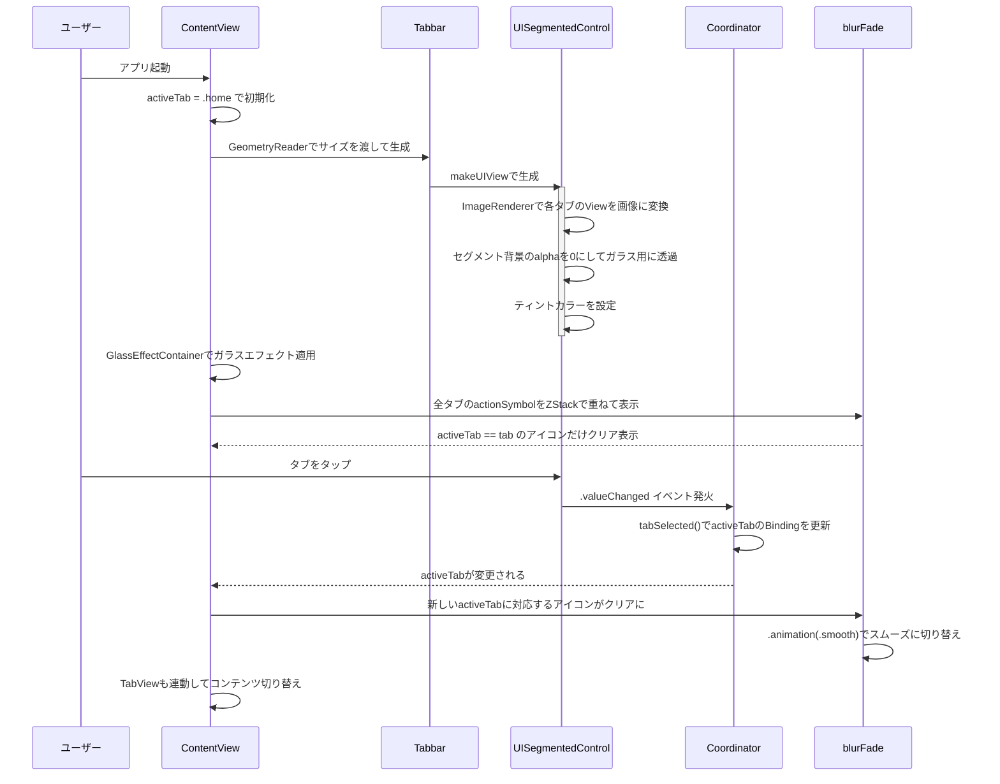

# iOS 26 Glass Effect タブバー

iOS 26で追加された GlassEffectContainer と .glassEffect() を使って、すりガラス風のカスタムタブバー
UISegmentedControlをSwiftUIにラップして、ガラスエフェクトのカプセル型タブバーにしてる
タブを切り替えると右側のアクションボタンがブラー+フェードで同期的に切り替わる

## Sampleでやってること

- Home / Notifications / Settings の3タブ構成
- 左側のカプセルではUISegmentedControl ベースのタブバーに .glassEffect(.regular.interactive(), in: .capsule) を適用
- 右側のカプセルでは選択中のタブに対応するアクションアイコンを表示しかつ切り替え時にブラー+フェードアニメーション
- 全体をGlassEffectContainerで囲んでガラスエフェクトを統一管理

## 各ファイルの解説

### ContentView.swift

メインの画面構成。
上部に標準のTabView、下部にカスタムのガラス風タブバーを配置してる。

MainTabBarView()がカスタムタブバーの本体で、GlassEffectContainerの中に2つのカプセルを横並びにしてる。
左のカプセルは GeometryReader で親のサイズを取得してTabbarに渡してる。
右のカプセルはForEachで全タブのactionSymbolをZStackで重ねていて、activeTab == tabの条件でblurFadeを切り替える
.animation(.smooth(duration: 0.55, extraBounce: 0))でスムーズなトランジションになってる

### Tabbar.swift

UISegmentedControlをUIViewRepresentableでラップしたカスタムタブバー

makeUIViewでUISegmentedControlを生成して、各タブのSwiftUI ViewをImageRendererで画像に変換してセグメントにセットしてる
.withRenderingMode(.alwaysTemplate) にすることでティントカラーが効くようにしてる

ポイントはDispatchQueue.main.asyncでセグメントの背景UIImageViewのalphaを0にしてるところ
これをやらないとセグメントのデフォルト背景が出てきてガラスエフェクトの見た目を邪魔する

Coordinatorパターンで.valueChangedイベントを受け取って、activeTab のBindingを更新してる
sizeThatFitsをオーバーライドして、外部から渡されたsizeでサイズを制御してる

### View+Extension.swift

blurFadeモディファイアを定義してる。

statusがtrueのときはクリア表示（ブラー0、不透明度1）、false のときはブラー+フェードアウト（ブラー10、不透明度0）になる。
.compositingGroup()でView全体をグループ化してからブラーをかけてるので、子Viewが個別にブラーされるのを防いでる

右側カプセルのアクションアイコン切り替えに使ってて、選択中のタブのアイコンだけがクリアに見えて、それ以外はぼやけて消えるようにしている

## 処理の流れ

## iOS 26 新API

このプロジェクトで使ってるiOS 26のAPI

- GlassEffectContainerはガラスエフェクトを適用するViewのコンテナ。中のViewに対して統一的にガラスの見た目を提供する
- .glassEffect(.regular.interactive(), in: .capsule)：Viewにすりガラス風のエフェクトを適用するモディファイア。
    .regular がスタイル、.interactive() がインタラクション対応、.capsule が形状

iOS 25以下だとこれらのAPIが使えないので、代替として .background(.ultraThinMaterial)あたりで似た見た目を作ることになる。
ただしガラスの質感や統一管理はGlassEffectContainerの方がずっと簡単ぽい
