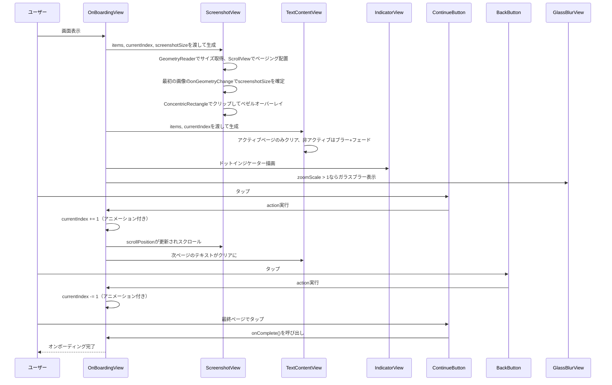

# iOS 26 OnBoarding（デバイスフレーム付きスクリーンショットページング）

https://github.com/user-attachments/assets/e71bf028-c3e5-45f6-9186-77f7652a2fdb

オンボーディング画面の作成
デバイスフレーム風ベゼル付きのスクリーンショットをページングで表示し、ズーム・ブラー・ガラスボタンで演出するやつ
画像はURL優先でnilや失敗時はアセットカタログにフォールバックするようにしている

## Sampleでやってること

- デバイスフレーム風のベゼル（ConcentricRectangle）でスクリーンショットを囲んでる
- 水平スクロールでスクリーンショットをページング（プログラマティック制御）
- 各ページにzoomScale/zoomAnchorを指定して特定箇所をズーム表示できるようにしてる
- テキスト切り替え時に非アクティブページをブラー+フェードアウトで隠してる
- ページインジケーターはアクティブドットがCapsuleで伸びるやつ
- ボタンはglassProminentとglassスタイルで統一
- ズーム時のみ下部にガラスブラー背景が出る
- 画像はURL優先、nilまたは失敗時にアセットカタログへフォールバック

## 各ファイルの解説

### OnBoardingItem.swift

オンボーディングの各ページのデータモデル。
screenshotURLにURLを入れればAsyncImageで読み込んで、nilならfallbackImageのアセット名を使う。
zoomScaleとzoomAnchorでページごとにスクリーンショットのどこをズームするか制御できる。
Sendable準拠でSwift 6対応してる。

### OnBoardingView.swift

ルートView。各サブViewを組み合わせてレイアウトしてるだけ。
スクリーンショット領域・テキスト領域・インジケーター・Continue/BackボタンをZStackで重ねてる。
onCompleteコールバックで最終ページタップ時の処理を外部に委譲する形。

### OnBoardingScreenshotView.swift

デバイスフレーム風のベゼル付きでスクリーンショットをページング表示するやつ。
GeometryReaderで親サイズを取得して、ScrollView(.horizontal)でページング配置してる。
ConcentricRectangleで角丸クリップして、3層ストローク（白→黒→黒）でベゼルを再現してる。
deviceCornerRadiusは画像の実サイズとレンダリングサイズの比率から自動算出してるので、画像が変わっても角丸が崩れない。

### ScreenshotImageView.swift

画像表示だけを担当するView。
screenshotURLがあればAsyncImageで非同期読み込み、失敗またはnilならアセットカタログの画像を表示するフォールバック設計。
OnBoardingScreenshotViewの中で使ってる。

### OnBoardingTextContentView.swift

タイトル・サブタイトルをページング表示する
アクティブページのみクリア表示、非アクティブページはブラー半径30+不透明度0で完全に隠してる。
scrollTargetBehavior(.paging)で正確にページ単位でスナップする。

### OnBoardingIndicatorView.swift

ページインジケーター。アクティブドットはCapsule幅25、非アクティブは6で、切り替え時にアニメーションで伸び縮みする。

### OnBoardingContinueButton.swift

最終ページでは「はじめよう」、それ以外では「つぎへ」を表示するボタン。
glassProminentスタイルでcontentTransition(.numericText())を使ってテキスト切り替えをアニメーションしてる。

### OnBoardingBackButton.swift

画面左上に固定配置される円形の戻るボタン。glassスタイルとbuttonBorderShape(.circle)で丸いガラスボタンにしてる。

### OnBoardingGlassBlurView.swift

ズームされたスクリーンショットの下部にかかるガラスブラー背景。
zoomScale > 1のときのみ表示される。glassEffect(.clear, in: .rect)でLiquid Glass風の背景を実現してる。

### PhoneBorderView.swift

デバイスベゼルを描画する汎用View。OnBoardingScreenshotViewの中でインライン実装されてるものの単体プレビュー・再利用用に独立させてある。

## 処理の流れ

## 使用API

- glassEffect(.clear, in: .rect)はViewにすりガラス風エフェクトを適用するやつ。GlassBlurViewで使ってる
- buttonStyle(.glassProminent)はガラス風の目立つボタンスタイル。Continueボタンで使ってる
- buttonStyle(.glass)はガラス風の控えめなボタンスタイル。Backボタンで使ってる
- buttonSizing(.flexible)はボタンのサイズを親に合わせてフレキシブルにするやつ
- ConcentricRectangleは同心の角丸矩形シェイプ。デバイスフレームの再現に使ってる
- containerShape()はコンテナの形状を子Viewに伝搬するやつ

iOS 25以下だとbackground(.ultraThinMaterial)や通常のRoundedRectangleで代替することになるけど、Liquid Glassの質感は再現できない
