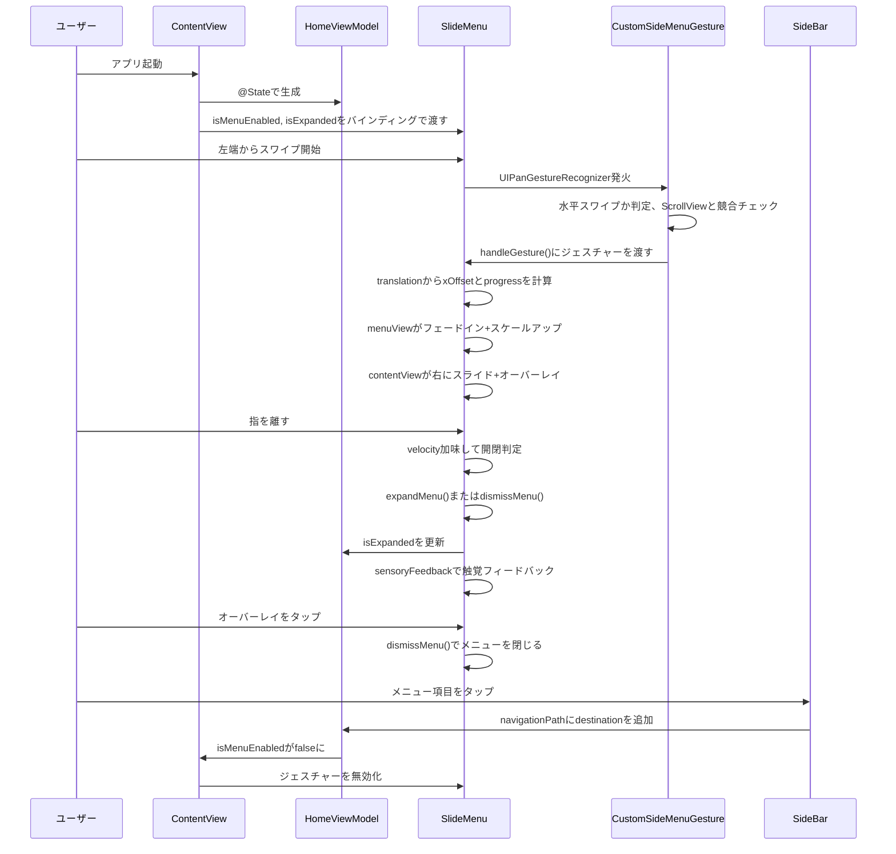

# iOS 26 スライド式サイドメニュー（X/Twitter風）

X風のスライド式サイドメニュー
左端からのスワイプでサイドメニューが開いて、メインコンテンツが右にスライドするやつ
iOS 26のConcentricRectangleでデバイスの角丸に追従するマスクをかけてて、UIPanGestureRecognizerをUIGestureRecognizerRepresentableでラップしてる

## Sampleでやってること

- 左端スワイプまたはボタンタップでサイドメニューを開閉
- メインコンテンツがスワイプに追従して右にスライドし、半透明オーバーレイがかかる
- サイドメニューはフェードイン+スケールアップで出てくる
- メニュー展開中にコンテンツ領域タップで閉じる
- ナビゲーション遷移中はサイドメニューのジェスチャーを無効化
- 開閉時に触覚フィードバック
- ConcentricRectangleでデバイスの角丸に追従するマスク+影

## 各ファイルの解説

### ContentView.swift

メイン画面
HomeViewModelで状態管理して、SlideMenuにサイドバーとタブ+ナビゲーションを渡してる
ナビゲーション遷移中はviewModel.isMenuEnabledでサイドメニューのジェスチャーを無効化する

### HomeViewModel.swift

ホーム画面の状態を管理するViewModel
activeTab、navigationPath、isExpandedを持ってて、isMenuEnabledはnavigationPath.isEmptyの算出プロパティ

### SlideMenu.swift

スライド式サイドメニューのコンテナ。
ジェネリクスでmenuContentとcontentを受け取る
UIPanGestureRecognizerのtranslationとvelocityからオフセットと進捗を計算して、メニューの開閉をリアルタイムに追従させてる
指を離したときはvelocityを加味して開くか閉じるか判定する

### CustomSideMenuGesture.swift

UIGestureRecognizerRepresentableでUIPanGestureRecognizerをラップしたカスタムジェスチャー
Coordinatorパターンでgesturerecognizerのdelegateを実装してて、水平スワイプのみ受け付ける。
右スワイプは常に許可、左スワイプはメニュー展開中のみ許可する
ScrollViewが左端（offset <= 0）のときはこのジェスチャーを優先させることで、スクロール中にサイドメニューが誤って開かないようにしてる。

### SideBar.swift

サイドバーの中身。MenuItemHeaderViewでプロフィール表示、makeSampleMenuItemsからMenuItemMainViewでメニュー項目を表示してる。
ScrollViewの上部にDividerオーバーレイを配置してセクション区切りにしてる。

### MenuItem.swift

メニューアイテムのデータモデル
title、iconURL、iconSystemName、defaultIcon、destinationを持つ

### MenuItemHeaderView.swift

サイドバー上部のプロフィール表示。アバター（Circle）、ユーザー名、ハンドル名、フォロー/フォロワー数を表示する

### MenuItemMainView.swift

アイコン付きメニューボタン
iconURLがあればAsyncImageで読み込み、なければiconSystemNameでSFSymbolを表示する
アイコンサイズ・フォント・カラー・パディングは全部プロパティで外部からカスタマイズ可能

### DummyCardView.swift

SNS風のプレースホルダーカード。
アバター、テキスト、画像、アクションアイコンをグレーの矩形で模したダミーUI

## 処理の流れ

## 使用API

- ConcentricRectangle(corners: .concentric, isUniform: true)はデバイスの角丸に追従する同心角丸矩形。メインコンテンツのマスクと影に使ってる
- UIGestureRecognizerRepresentableはUIKitのジェスチャーをSwiftUIで使うためのプロトコル。UIPanGestureRecognizerのラップに使ってる
- sensoryFeedback(.impact(weight: .light), trigger:)はメニュー開閉時の触覚フィードバック
- @Observable（Observationフレームワーク）でViewModelの状態管理

iOS 25以下だとConcentricRectangleが使えないので、RoundedRectangle(cornerRadius: 45)で代替してる
